<center>

# PHP COMPOSSER

</center>

<center>

## A. POINT UTAMA

</center>

### 1. Dependency Management

- `Dependency Management Tool` bertugas mendownload semua _library_ yang diperlukan. Dan semua dilakukan secara otomatis

- `Dependency Management Tool` juga bisa mendownload _library_ sesuai dengan versi yang dibutuhkan secara otomatis.

---

### 2. Composer

- `Composer` adalah salah satu `Dependency Management Tool` yang populer di PHP.

- Dengan `composer` kita cukup membuat konfigurasi file berisi dependency yang dibutuhkan.

- Jika sudah mendownload & menginstall `composer`, ketikan `composer --version` pada comand promt untuk mengecek versi `conposer` nya.

- Cara kerja `Composer`

  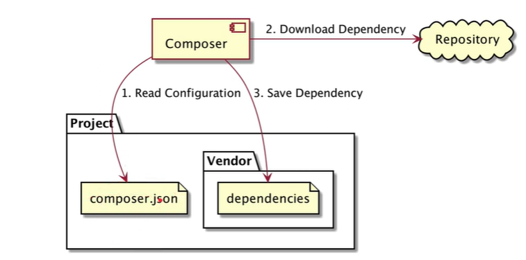

---

### 3. Membuat Project Composer

- Cara membuatnya cukup sederhana, kita tinggal membuat file `.json` pada project PHP kita.

- Dan bisa juga membuatnya secara otomatis menggunakan perintah `composer init` pada command promt.

  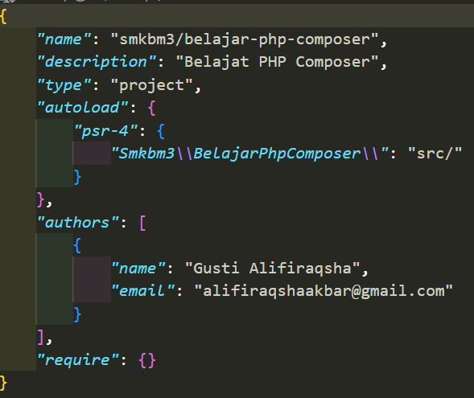

Menginstall Dependency

- Setelah membuat project `composer` kita perlu menginstall `dependency`.

- Gunakan perintah `composer update` di terminal untuk menginstall `dependency`.

- Hasil semua instalasi `dependency` akan disimpan didalam folder `vendor`.

---

### 4. Program Pertama Composer ("Hello World!")

- `Composer` secara otomatis akan menyimpan semua _library_ yang kita punya didalam _directory_ `vendor`.

- Kita cukup menggunakan `file/vendor/autoload.php` yang secara otomatis di generate oleh `composer`.

- Gunakan file `autoload.php`, itu akan secara otomatis meng-include class yang kita butuhkan di _library_.

  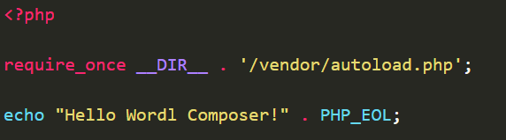

---

### 5. Autoload

- `Composer` menggunakan fitur PHP _class_ `Autoload` yang terdapat didalam folder `vendor`.

- Setelah menambahkan file `autoload`, kita perlu generate ulang file `autoload.php`.

- Gunakan perintah `composer dump-autoload` untuk generate ulang.

  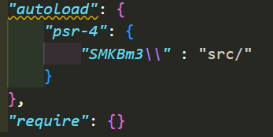

---

### 6. Pembuatan Source Code

- Pada `composer.json` kita sudah menggunakan _namespace_ `SMKBm3` di directory _src_.

- Lalu import _class_ di _namespace_ `SMKBm3`, maka akan di include file didalam directory _src_.

  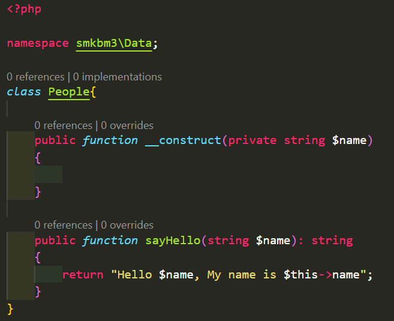

- Menggunakan Autoload

  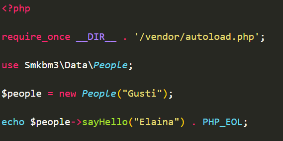

---

### 7. Repository

- Repository merupakan tempat `dependency` disimpan.

---

### 8. Manambahkan Dependency

- Salah satu keuntungan menggunakan `composer` adalah kita bisa menambahkan `dependency` _library_ yag dibutuhkan.

- Ada dua jenis _library_ di `composer`. _Library_ saat Development dan _library_ yang digunakan saat aplikasi berjalan.

- Saat menambahkan _library_ kita perlu memberi tahu ke `composer` versi berapa yang kita gunakan.

- Tambahkan monolog pada file `.json`.

  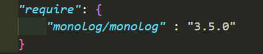

- Menjalankan Monolog

  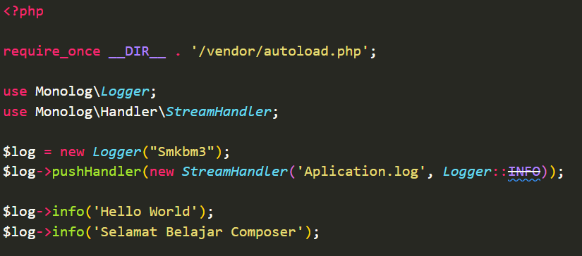

---

### 9. Library

- Buat directory baru, sama seperti sebelumnya bedanya `Type` nya di ganti `library`.

  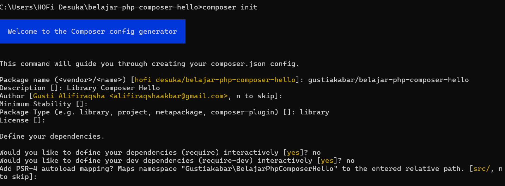

- Kode Library yang baru dibuat

  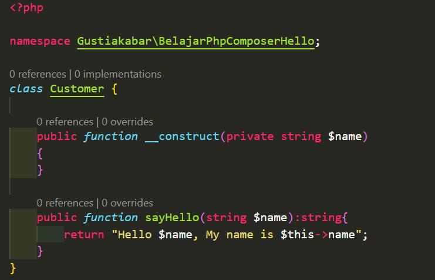

---

### 10. Upload Ke Repository

- Setelah membuat _library_ kita akan upload ke Git Repository, GitHub.

- Setelah di upload kita buat `tag` sebagai penanda versi realease _library_ kita.

---

### 11. Download dari Repository

- `Composer` juga terintegrasi dengan Git Repository, jadi kita bisa menambahakan `git repository` sebagai `composer git`.

  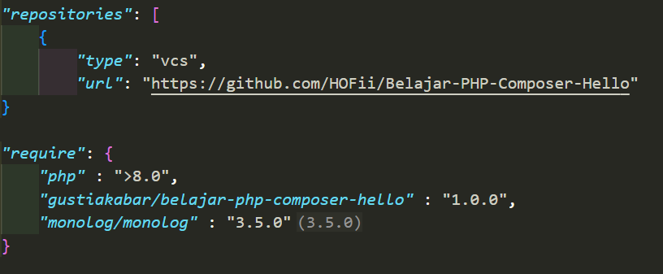

- Kode incule library

  ````PHP
  <?php

  require_once __DIR__ . '/vendor/autoload.php';

  $customer = new \Gustiakabar\BelajarPhpComposerHello\Customer("Gusti");
  $customer->sayHello("Elaina") . PHP_EOL;
      ```
  ````

---

### 12. Upgrade Versi Library

    ```PHP
    "require": {
        "php" : ">8.0",
        "gustiakabar/belajar-php-composer-hello" : "2.0.0",
        "monolog/monolog" : "3.5.0"
    }
    ```

---

### 13. Fitur Lainnya

    ```PHP
    "Scripts": {
        "Jalankan-server" : "php -S localhost:8080",
        "hello" : "echo 'Hello World'"
    }
    ```

---

## B. Pertanyaan & Catatan Tambahan

- Tidak bisa menambahkan `tag` di github

  

  

---

## C. Kesimpulan

- Dengan belajar PHP Composer bisa mempermudah dalam development web, mulai dari menggunakan library, plugin dll.
